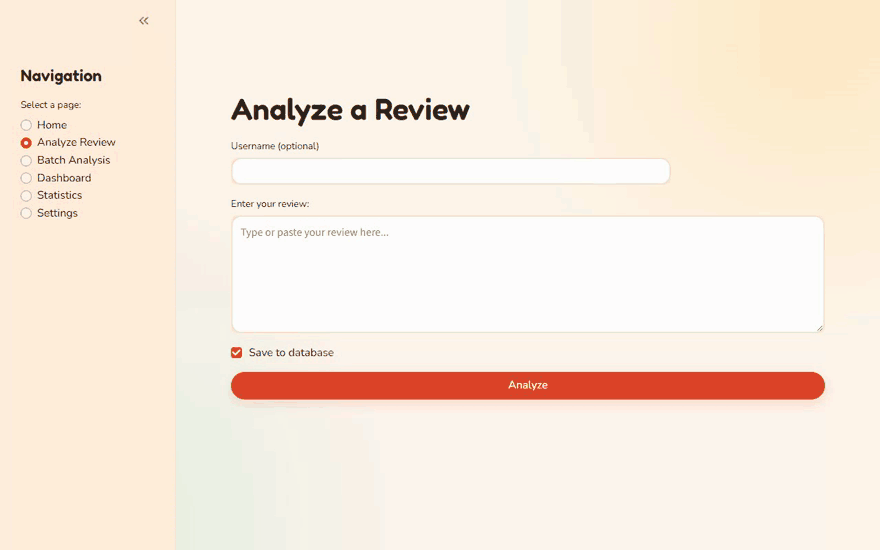

# Sentiment Analysis Tool

A Python NLP tool that classifies reviews as **positive, negative, neutral, or mixed**, breaks them down by aspect, and serves results through a REST API and an interactive dashboard.



## Features

- **Lexicon-based sentiment engine** built on spaCy: a ~6,800-term lexicon graded into mild / medium / strong intensity tiers
- **Linguistic handling**: negation, intensifiers and diminishers, contractions, internet slang, emoji sentiment and emoji-based sarcasm cues, and typo-tolerant fuzzy matching
- **Aspect-based analysis**: identifies what a review is about (e.g. design, service, value, performance) and scores each aspect separately
- **Batch processing**: spaCy `nlp.pipe` batching, cached lemmatization, and bulk SQLite inserts
- **Flask REST API**: single and batch analysis, review search and filtering, statistics, trends, and export, with an OpenAPI spec at `/openapi.json`
- **Streamlit + Plotly dashboard**: sentiment distribution, aspect breakdowns, confidence scores, and trends over time
- **Extras**: review quality scoring, duplicate detection, temporal tracking, and PDF report generation (ReportLab)

## Tech Stack

Python · spaCy · Flask · SQLite · Streamlit · Plotly · pandas · ReportLab

## Getting Started

Install dependencies and the spaCy English model:

```bash
pip install -r requirements.txt
python -m spacy download en_core_web_sm
```

Start the REST API from `src/`. The code imports some modules as `src.…`, so the project root must be on `PYTHONPATH`:

```bash
cd src
PYTHONPATH=.. python sentiment_api.py              # macOS / Linux
```

```powershell
cd src
$env:PYTHONPATH = ".."; python sentiment_api.py   # Windows PowerShell
```

The API runs on http://localhost:5000. In a second terminal, start the dashboard (it talks to the API):

```bash
cd src
streamlit run sentiment_analysis_dashboard.py      # http://localhost:8501
```

Configuration is read from a `.env` file (see `src/app_config.py` for the available settings).

## Example

```bash
curl -X POST http://localhost:5000/api/v1/analyze \
  -H "Content-Type: application/json" \
  -d '{"text": "Love the design, but the battery life is terrible.", "save_to_db": false}'
```

## Limitations

- Rule-based by design: there is no trained model, and no labeled accuracy evaluation yet.
- The domain-specific adjustment step is currently disabled, so all reviews are scored with the general lexicon.
